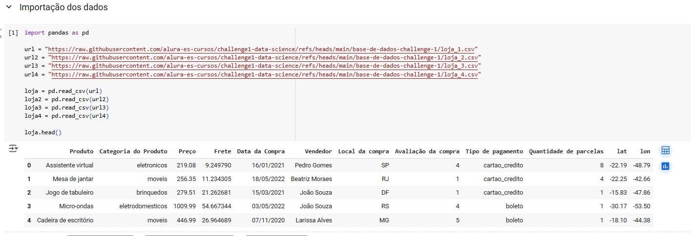
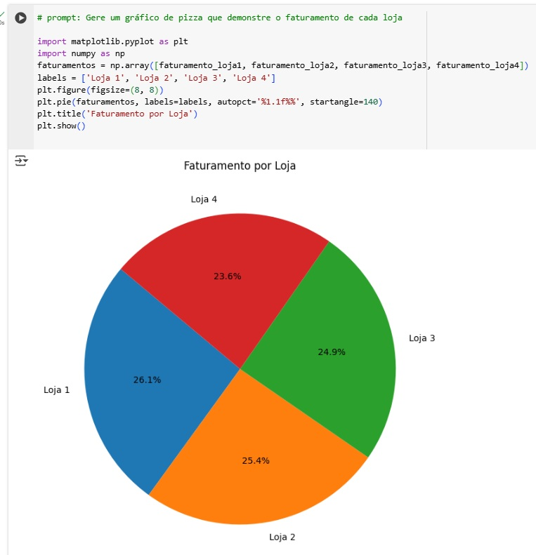
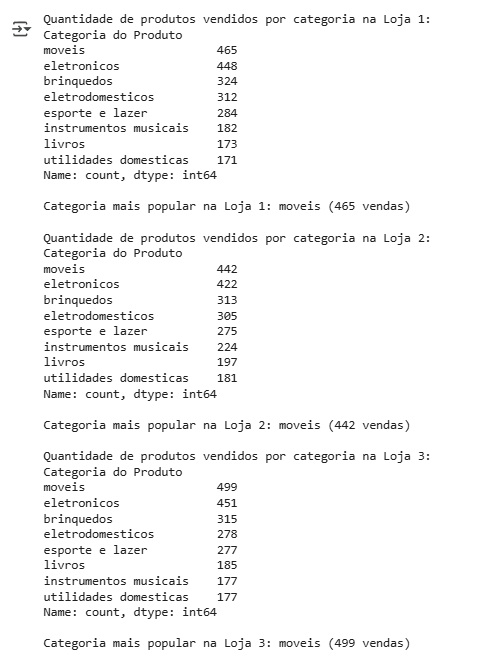
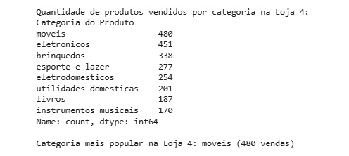
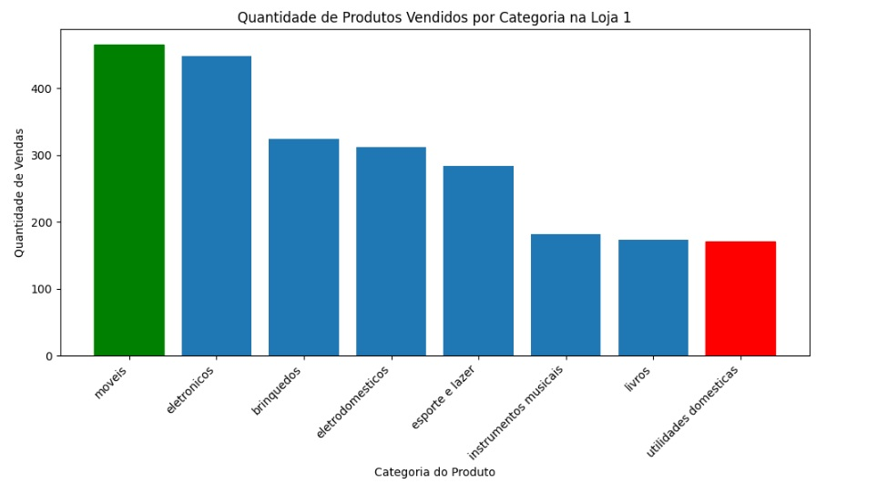
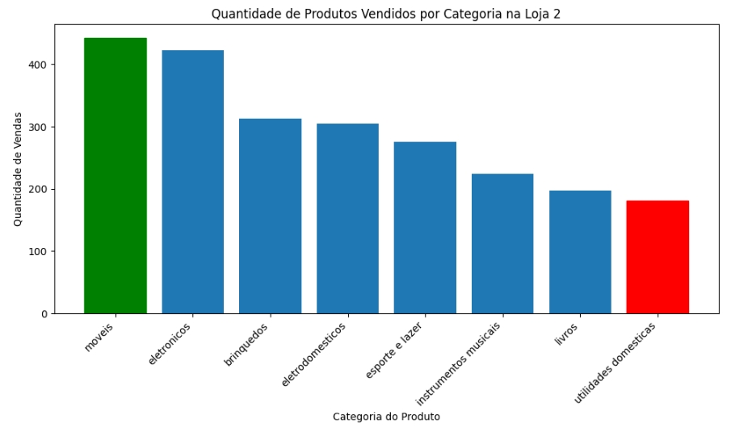
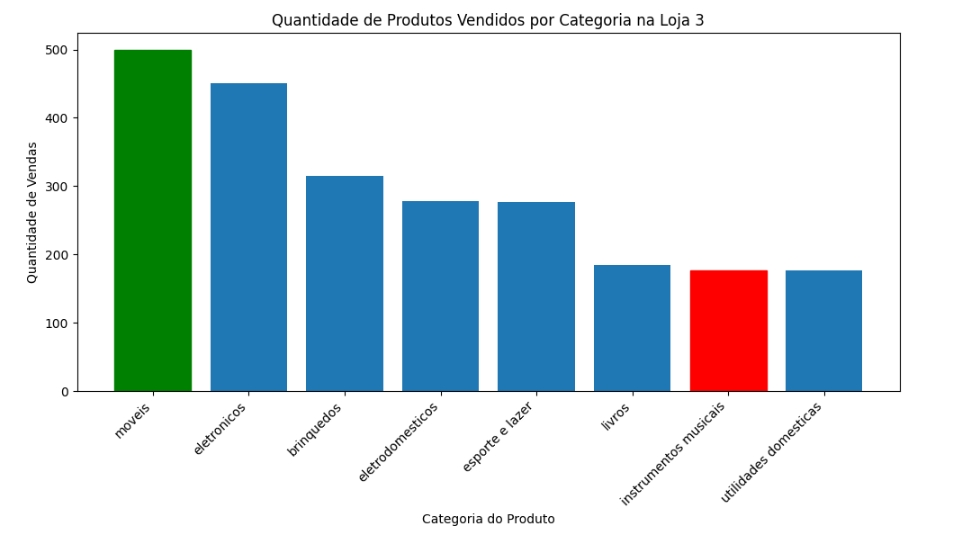
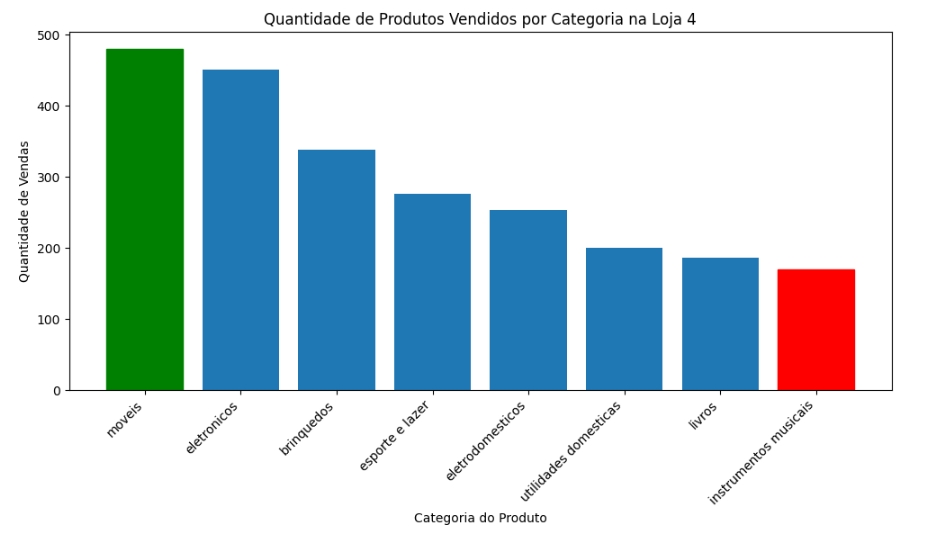
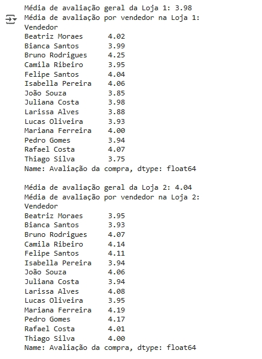

# aluraStoreVenda

#### link do notebook do projeto (Análise de dados em python para indicar a venda de uma de quatro lojas)
https://colab.research.google.com/drive/1xQvJUpLlBEk1vSLc6TcByC_DhSqa7ziV?usp=sharing

### importação dos dados



### Analise do faturamento

###### Total vendido por cada loja.


### Gráfico em Pizza do Faturamento por loja



### Vendas por Categoria

###### Calculando a quantidade de produtos vendidos em cada categoria.

```python
# prompt: Calcule a quantidade de produtos vendidos por categoria em cada loja. agrupe os dados por categoria e conte o numero de vendas de cada tipo, mostre as categorias mais populares de cada loja.

# Função para calcular a quantidade de produtos vendidos por categoria em uma loja
def analise_vendas_categoria(df, nome_da_loja):
  categoria_vendida = df['Categoria do Produto'].value_counts()
  print(f"\nQuantidade de produtos vendidos por categoria na {nome_da_loja}:")
  print(categoria_vendida)
  print(f"\nCategoria mais popular na {nome_da_loja}: {categoria_vendida.idxmax()} ({categoria_vendida.max()} vendas)")

# Analisar vendas por categoria em cada loja
analise_vendas_categoria(loja, "Loja 1")
analise_vendas_categoria(loja2, "Loja 2")
analise_vendas_categoria(loja3, "Loja 3")
analise_vendas_categoria(loja4, "Loja 4")
```




### Gráfico de barras, individualizado por loja das vendas por categoria, destacando a pior e a melhor categoria.

```python
# prompt: Fazer um gráfico de barras, individual para cada loja, deve mostrar no gráfico a melhor e a pior categoria por loja para:
# 1 - Quantidade de produtos vendidos por categoria na loja 1
# 2 - Quantidade de produtos vendidos por categoria na loja 2
# 3 - Quantidade de produtos vendidos por categoria na loja 3
# 4 - Quantidade de produtos vendidos por categoria na loja 4

def graficobarra_vendas_categoria(df, nome_da_loja):
    vendas_categoria = df['Categoria do Produto'].value_counts()

    plt.figure(figsize=(10, 6))
    bars = plt.bar(vendas_categoria.index, vendas_categoria.values)
    plt.title(f'Quantidade de Produtos Vendidos por Categoria na {nome_da_loja}')
    plt.xlabel('Categoria do Produto')
    plt.ylabel('Quantidade de Vendas')
    plt.xticks(rotation=45, ha='right')
    plt.tight_layout()

    # Destacar a melhor e pior categoria
    melhor_categoria = vendas_categoria.idxmax()
    pior_categoria = vendas_categoria.idxmin()

    for i, categoria in enumerate(vendas_categoria.index):
        if categoria == melhor_categoria:
            bars[i].set_color('green') # Melhor categoria em verde
        elif categoria == pior_categoria:
            bars[i].set_color('red')   # Pior categoria em vermelho

    plt.show()

# Gerar gráficos para cada loja
graficobarra_vendas_categoria(loja, "Loja 1")
graficobarra_vendas_categoria(loja2, "Loja 2")
graficobarra_vendas_categoria(loja3, "Loja 3")
graficobarra_vendas_categoria(loja4, "Loja 4")
```








### Média de avaliação dos clientes para cada loja, individualizar a média de avaliação para cada vendedor.

```python
# prompt: calcule a média de avaliação das lojas. usando o campo: Avaliação da compra para cada loja, inclua a avaliação individual de cada vendedor por loja, use o campo Vendedor

# Função para calcular a média de avaliação geral da loja e por vendedor
def analise_notas(df, nome_da_loja):
  media_nota_loja = df['Avaliação da compra'].mean()
  print(f"\nMédia de avaliação geral da {nome_da_loja}: {media_nota_loja:.2f}")

  media_nota_vendedor = df.groupby('Vendedor')['Avaliação da compra'].mean()
  print(f"Média de avaliação por vendedor na {nome_da_loja}:")
  print(round(media_nota_vendedor,2))

# Analisar avaliações em cada loja
analise_notas(loja, "Loja 1")
analise_notas(loja2, "Loja 2")
analise_notas(loja3, "Loja 3")
analise_notas(loja4, "Loja 4")
```




