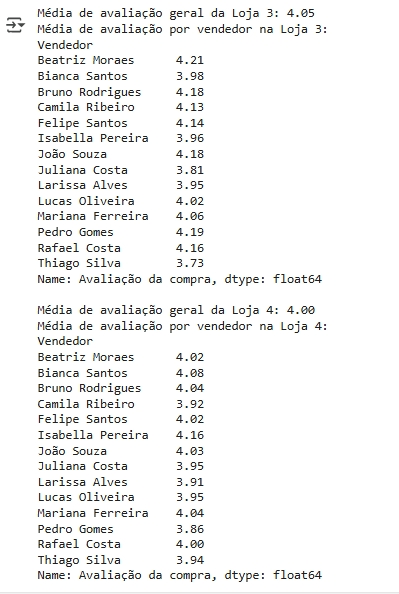

# aluraStoreVenda

#### link do notebook do projeto (Análise de dados em python para indicar a venda de uma de quatro lojas)
https://colab.research.google.com/drive/1xQvJUpLlBEk1vSLc6TcByC_DhSqa7ziV?usp=sharing

### importação dos dados


### Analise do faturamento

###### Total vendido por cada loja.


### Gráfico em Pizza do Faturamento por loja


### Vendas por Categoria

###### Calculando a quantidade de produtos vendidos em cada categoria.

```python
# prompt: Calcule a quantidade de produtos vendidos por categoria em cada loja. agrupe os dados por categoria e conte o numero de vendas de cada tipo, mostre as categorias mais populares de cada loja.

# Função para calcular a quantidade de produtos vendidos por categoria em uma loja
def analise_vendas_categoria(df, nome_da_loja):
  categoria_vendida = df['Categoria do Produto'].value_counts()
  print(f"\nQuantidade de produtos vendidos por categoria na {nome_da_loja}:")
  print(categoria_vendida)
  print(f"\nCategoria mais popular na {nome_da_loja}: {categoria_vendida.idxmax()} ({categoria_vendida.max()} vendas)")

# Analisar vendas por categoria em cada loja
analise_vendas_categoria(loja, "Loja 1")
analise_vendas_categoria(loja2, "Loja 2")
analise_vendas_categoria(loja3, "Loja 3")
analise_vendas_categoria(loja4, "Loja 4")
```


### Gráfico de barras, individualizado por loja das vendas por categoria, destacando a pior e a melhor categoria.

```python
# prompt: Fazer um gráfico de barras, individual para cada loja, deve mostrar no gráfico a melhor e a pior categoria por loja para:
# 1 - Quantidade de produtos vendidos por categoria na loja 1
# 2 - Quantidade de produtos vendidos por categoria na loja 2
# 3 - Quantidade de produtos vendidos por categoria na loja 3
# 4 - Quantidade de produtos vendidos por categoria na loja 4

def graficobarra_vendas_categoria(df, nome_da_loja):
    vendas_categoria = df['Categoria do Produto'].value_counts()

    plt.figure(figsize=(10, 6))
    bars = plt.bar(vendas_categoria.index, vendas_categoria.values)
    plt.title(f'Quantidade de Produtos Vendidos por Categoria na {nome_da_loja}')
    plt.xlabel('Categoria do Produto')
    plt.ylabel('Quantidade de Vendas')
    plt.xticks(rotation=45, ha='right')
    plt.tight_layout()

    # Destacar a melhor e pior categoria
    melhor_categoria = vendas_categoria.idxmax()
    pior_categoria = vendas_categoria.idxmin()

    for i, categoria in enumerate(vendas_categoria.index):
        if categoria == melhor_categoria:
            bars[i].set_color('green') # Melhor categoria em verde
        elif categoria == pior_categoria:
            bars[i].set_color('red')   # Pior categoria em vermelho

    plt.show()

# Gerar gráficos para cada loja
graficobarra_vendas_categoria(loja, "Loja 1")
graficobarra_vendas_categoria(loja2, "Loja 2")
graficobarra_vendas_categoria(loja3, "Loja 3")
graficobarra_vendas_categoria(loja4, "Loja 4")
```


### Média de avaliação dos clientes para cada loja, individualizar a média de avaliação para cada vendedor.

###### OBS: Perceba que o dataset de cada loja, possuei os mesmos vendedores, assuma-se que eles fazem rodizio trabalhando suas vendas em todas as lojas:

```python
# prompt: calcule a média de avaliação das lojas. usando o campo: Avaliação da compra para cada loja, inclua a avaliação individual de cada vendedor por loja, use o campo Vendedor

# Função para calcular a média de avaliação geral da loja e por vendedor
def analise_notas(df, nome_da_loja):
  media_nota_loja = df['Avaliação da compra'].mean()
  print(f"\nMédia de avaliação geral da {nome_da_loja}: {media_nota_loja:.2f}")

  media_nota_vendedor = df.groupby('Vendedor')['Avaliação da compra'].mean()
  print(f"Média de avaliação por vendedor na {nome_da_loja}:")
  print(round(media_nota_vendedor,2))

# Analisar avaliações em cada loja
analise_notas(loja, "Loja 1")
analise_notas(loja2, "Loja 2")
analise_notas(loja3, "Loja 3")
analise_notas(loja4, "Loja 4")
```




### Gráfico em linha mostrando a avaliação individual dos vendedores por loja.

```python
# prompt: use grafico em linha e mostre a avaliação média dos clientes, individualize por loja, identifique o vendedor melhor e pior avaliado por loja

def avaliacao_de_vendedores(df, nome_da_loja):
    notas_vendedor = df.groupby('Vendedor')['Avaliação da compra'].mean().sort_values()

    plt.figure(figsize=(12, 6))
    plt.plot(notas_vendedor.index, notas_vendedor.values, marker='o', linestyle='-')
    plt.title(f'Avaliação Média dos Vendedores na {nome_da_loja}')
    plt.xlabel('Vendedor')
    plt.ylabel('Avaliação Média')
    plt.xticks(rotation=45, ha='right')
    plt.grid(True)
    plt.tight_layout()

    # Identificar o melhor e pior vendedor
    melhor_vendedor = notas_vendedor.idxmax()
    pior_vendedor = notas_vendedor.idxmin()

    plt.scatter(melhor_vendedor, notas_vendedor[melhor_vendedor], color='green', s=100, zorder=5, label=f'Melhor: {melhor_vendedor} ({notas_vendedor[melhor_vendedor]:.2f})')
    plt.scatter(pior_vendedor, notas_vendedor[pior_vendedor], color='red', s=100, zorder=5, label=f'Pior: {pior_vendedor} ({notas_vendedor[pior_vendedor]:.2f})')

    plt.legend()
    plt.show()

# Gerar gráficos de avaliação por vendedor para cada loja
avaliacao_de_vendedores(loja, "Loja 1")
avaliacao_de_vendedores(loja2, "Loja 2")
avaliacao_de_vendedores(loja3, "Loja 3")
avaliacao_de_vendedores(loja4, "Loja 4")
```


### Produtos Mais e Menos Vendidos por categoria e por loja e por Vendedor e por loja.

```python
# prompt: Identifique os produtos mais vendidos e menos vendidos por categoria e por loja, por vendedor e por loja. use os campos: Produtoo, Categoria do Produto, Preço, Vendedor

# Concatena os dataframes de todas as lojas
todas_lojas = pd.concat([loja.assign(Loja='Loja 1'),
                         loja2.assign(Loja='Loja 2'),
                         loja3.assign(Loja='Loja 3'),
                         loja4.assign(Loja='Loja 4')])

# Produtos mais e menos vendidos por categoria e por loja
print("\nProdutos mais e menos vendidos por categoria e por loja:")
produtos_por_categoria_loja = todas_lojas.groupby(['Loja', 'Categoria do Produto', 'Produto']).size().reset_index(name='Quantidade')

for loja_nome in todas_lojas['Loja'].unique():
    df_loja = produtos_por_categoria_loja[produtos_por_categoria_loja['Loja'] == loja_nome]
    print(f"\n--- {loja_nome} ---")
    for categoria in df_loja['Categoria do Produto'].unique():
        df_categoria = df_loja[df_loja['Categoria do Produto'] == categoria]
        produto_mais_vendido = df_categoria.loc[df_categoria['Quantidade'].idxmax()]
        produto_menos_vendido = df_categoria.loc[df_categoria['Quantidade'].idxmin()]
        print(f"  Categoria: {categoria}")
        print(f"    Mais vendido: {produto_mais_vendido['Produto']} ({produto_mais_vendido['Quantidade']} vendas)")
        print(f"    Menos vendido: {produto_menos_vendido['Produto']} ({produto_menos_vendido['Quantidade']} vendas)")

# Produtos mais e menos vendidos por vendedor e por loja
print("\nProdutos mais e menos vendidos por vendedor e por loja:")
produtos_por_vendedor_loja = todas_lojas.groupby(['Loja', 'Vendedor', 'Produto']).size().reset_index(name='Quantidade')

for loja_nome in todas_lojas['Loja'].unique():
    df_loja = produtos_por_vendedor_loja[produtos_por_vendedor_loja['Loja'] == loja_nome]
    print(f"\n--- {loja_nome} ---")
    for vendedor in df_loja['Vendedor'].unique():
        df_vendedor = df_loja[df_loja['Vendedor'] == vendedor]
        if not df_vendedor.empty:
            produto_mais_vendido = df_vendedor.loc[df_vendedor['Quantidade'].idxmax()]
            produto_menos_vendido = df_vendedor.loc[df_vendedor['Quantidade'].idxmin()]
            print(f"  Vendedor: {vendedor}")
            print(f"    Mais vendido: {produto_mais_vendido['Produto']} ({produto_mais_vendido['Quantidade']} vendas)")
            print(f"    Menos vendido: {produto_menos_vendido['Produto']} ({produto_menos_vendido['Quantidade']} vendas)")
        else:
            print(f"  Vendedor: {vendedor} - Sem vendas registradas.")
```

#### Loja 01: Produtos mais e menos vendidos.


#### Loja 02: Produtos mais e menos vendidos.


#### Loja 03: Produtos mais e menos vendidos.


#### Loja 04: Produtos mais e menos vendidos.


#### Loja 01 e Loja 02>: Produtos mais e menos vendidos por vendedor.


#### Loja 03 e Loja 04>: Produtos mais e menos vendidos por vendedor.


### Gráfico Coluna-linha, demonstrando a categoria que mais vende e menos vende por loja.

```python
# prompt: Gere gráfico de coluna-linha, demonstrando a categoria que mais vende e a categoria que menos vende, por loja.

# Função para criar o gráfico de coluna-linha
def grafico_coluna_linha_categoria(df, nome_da_loja):
    vendas_categoria = df['Categoria do Produto'].value_counts()

    # Criar o gráfico de barras
    fig, ax1 = plt.subplots(figsize=(10, 6))
    ax1.bar(vendas_categoria.index, vendas_categoria.values, color='skyblue', label='Quantidade de Vendas')
    ax1.set_xlabel('Categoria do Produto')
    ax1.set_ylabel('Quantidade de Vendas', color='skyblue')
    ax1.tick_params(axis='y', labelcolor='skyblue')
    ax1.set_title(f'Vendas de Categorias e Destaques na {nome_da_loja}')
    ax1.set_xticks(range(len(vendas_categoria.index)))  # Set ticks first
    ax1.set_xticklabels(vendas_categoria.index, rotation=45, ha='right')

    # Identificar a categoria mais e menos vendida
    melhor_categoria = vendas_categoria.idxmax()
    pior_categoria = vendas_categoria.idxmin()

    # Criar um segundo eixo y para os destaques (linha)
    ax2 = ax1.twinx()
    # Criamos uma lista para plotar no segundo eixo, com 1 para a melhor e -1 para a pior
    destaques = [1 if cat == melhor_categoria else (-1 if cat == pior_categoria else 0) for cat in vendas_categoria.index]
    ax2.plot(vendas_categoria.index, destaques, color='red', marker='o', linestyle='dashed', markersize=8, label='Destaque')
    ax2.set_ylabel('Destaque (1: Melhor, -1: Pior)', color='red')
    ax2.tick_params(axis='y', labelcolor='red')
    # Definir os ticks do segundo eixo para representar os destaques
    ax2.set_yticks([-1, 0, 1])
    ax2.set_yticklabels(['Pior', '', 'Melhor'])
    ax2.grid(False) # Remove a grade do segundo eixo

    # Adicionar rótulos para as categorias mais e menos vendidas no gráfico
    ax1.text(melhor_categoria, vendas_categoria[melhor_categoria], f' {vendas_categoria[melhor_categoria]}', color='green', ha='left', va='bottom', fontsize=9, weight='bold')
    ax1.text(pior_categoria, vendas_categoria[pior_categoria], f' {vendas_categoria[pior_categoria]}', color='red', ha='left', va='top', fontsize=9, weight='bold')

    # Adicionar legendas
    lines, labels = ax1.get_legend_handles_labels()
    lines2, labels2 = ax2.get_legend_handles_labels()
    ax2.legend(lines + lines2, labels + labels2, loc='upper right')


    plt.tight_layout()
    plt.show()

# Gerar o gráfico de coluna-linha para cada loja
grafico_coluna_linha_categoria(loja, "Loja 1")
grafico_coluna_linha_categoria(loja2, "Loja 2")
grafico_coluna_linha_categoria(loja3, "Loja 3")
grafico_coluna_linha_categoria(loja4, "Loja 4")
```

#### Loja 01: Produtos mais e menos vendidos por categoria.


#### Loja 02: Produtos mais e menos vendidos por categoria.


#### Loja 03: Produtos mais e menos vendidos por categoria.


#### Loja 04: Produtos mais e menos vendidos por categoria.


### Frete Médio por loja.

###### Descobrir o frete médio por loja.

```python
# prompt: Descubra o frete médio de cada loja

# Função para calcular o frete médio por loja
def calcula_frete(df, nome_da_loja):
  frete_medio = df['Frete'].mean()
  print(f"\nFrete médio da {nome_da_loja}: R$ {frete_medio:.2f}")

# Calcular e exibir o frete médio para cada loja
calcula_frete(loja, "Loja 1")
calcula_frete(loja2, "Loja 2")
calcula_frete(loja3, "Loja 3")
calcula_frete(loja4, "Loja 4")
```

