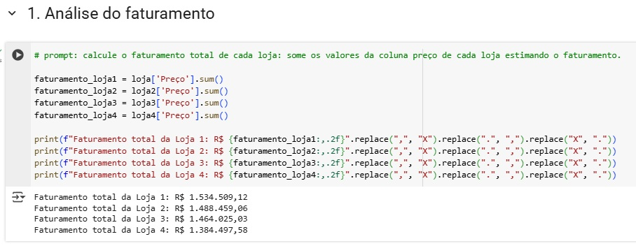

# aluraStoreVenda

#### link do notebook do projeto (Análise de dados em python para indicar a venda de uma de quatro lojas)
https://colab.research.google.com/drive/1xQvJUpLlBEk1vSLc6TcByC_DhSqa7ziV?usp=sharing

### importação dos dados

### Analise do faturamento

### Gráfico em Pizza do Faturamento por loja

